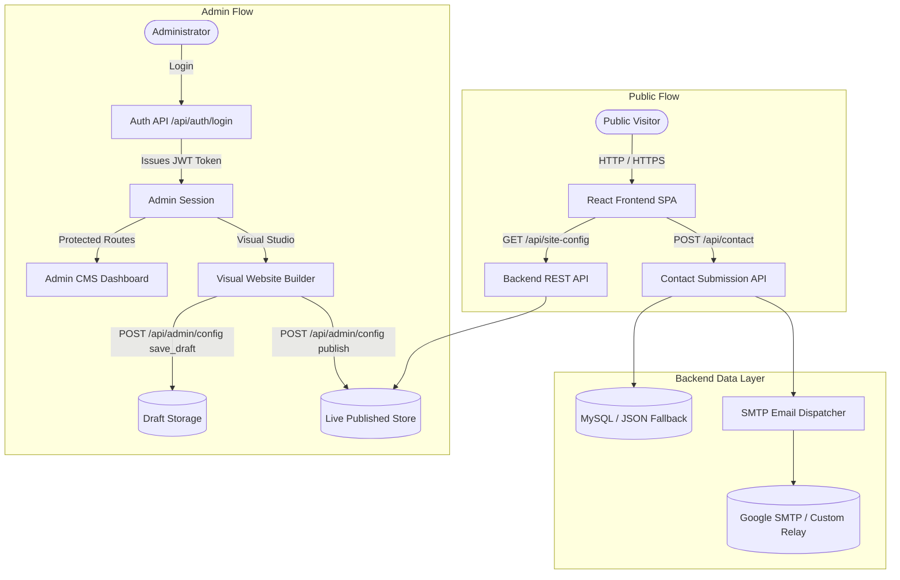
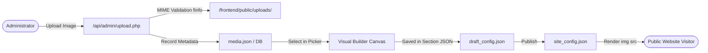
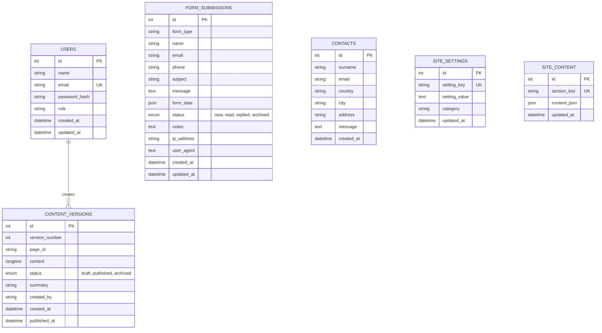

# Sports & MICE Website + Visual CMS

> A database-driven web platform with a custom Admin CMS and Visual Website Builder for managing pages, sections, components, media, forms, and published content for **K-Consulting Sports & MICE**.

---

## 1. Project Overview

**Sports & MICE** provides professional logistics, hotel scouting, delegation travel management, and conference hosting for sporting associations, federations, and corporate athletic events worldwide.

This repository contains the complete production-grade web application and content management system:

- **Public Website:** A fast, responsive, bilingual (English and German) website featuring dynamic hero sections, interactive service cards, hotel inspection galleries, process workflows, testimonials, FAQs, and contact inquiry forms.
- **Admin CMS:** A secure management back-office providing dashboard metrics, form submission inbox management with status tracking, site-wide settings, audit logs, media asset management, and content collection CRUD tools.
- **Visual Website Builder:** An in-context, real-time visual page builder that enables administrators to manage, create, customize, reorder, style, and publish website content, sections, and individual component elements directly through a browser UI without manually modifying frontend source code.
- **Safe Draft & Publish Engine:** A dual-state content engine that completely isolates administrator working drafts from the live public site. Edits are private until explicitly published, with authenticated live preview capabilities.

---

## 2. Key Features

### Public Website
- **Fully Responsive Design:** Optimized layouts across desktop, tablet, and mobile screen viewports.
- **Bilingual Internationalization:** Full English (`/en/`) and German (`/de/`) language support with automatic URL-based detection and synchronized language switching.
- **Dynamic & Static Routes:**
  - Home (`/`, `/en/`)
  - Service (`/en/Service/`, `/Dienstleistung/`)
  - About Us (`/en/About-us/`, `/Über-uns/`)
  - Hotels & More (`/en/Hotels-more/`, `/Hotels-mehr/`)
  - Contact (`/en/Contact/`, `/Kontakt/`)
  - Imprint & Privacy (`/en/Impressum-Datenschutzverordnung/`, `/Impressum-Datenschutzverordnung/`)
  - Custom dynamic pages loaded directly from the database (`/en/:slug`, `/:slug`).
- **Interactive Component Elements:**
  - High-performance video and image hero banners.
  - 4 Pillars Service Cards with hover actions and custom detail modals.
  - Hotel Inspection & Sights Gallery cards with location pins, descriptions, and dynamic modal dialogs.
  - Founder story and referee background timeline showcase.
  - Interactive FAQ accordion section with smooth expansion transitions.
  - Client testimonials with star ratings and referee credentials.
  - 4-Step MICE Success Formula workflow timeline.
  - Statistical counter milestone badges (15+ years, 500+ events, 35+ countries, 100% tailor-made).
- **Inquiry & Lead Capture:** Contact form with required field validation, real-time feedback, and anti-spam honeypot.
- **Interactive UI Utilities:** Real-time top reading scroll progress bar and floating quick-contact widgets (Email, Phone, WhatsApp, Scroll to Top).

### Admin CMS
- **Secure Authentication:** Token-based admin authentication with protected route guards and auto-logout on token expiration.
- **Dashboard & Analytics:** Live overview metrics displaying total inquiries, new unread submissions, published content version, draft status, and recent activity timeline.
- **Page Management:** Manage existing pages, configure SEO metadata (title, meta description, keywords), enable/disable pages, and create new custom dynamic routes.
- **Form Submissions Inbox:** Review, search, filter, update workflow status (`new`, `read`, `replied`, `archived`), add internal admin notes, and export or delete visitor inquiries.
- **Content Collections CRUD:** Dedicated structured editors for Services, Team Members, Testimonials, FAQs, and Gallery items.
- **Media Library:** Upload images with server-side validation, browse uploaded media assets, view image metadata, and copy asset URLs.
- **Theme & Typography Customizer:** Customize global primary, secondary, and accent colors, typography font families, font sizes, and container widths.
- **Header & Footer Manager:** Manage navigation links, logo branding, social media links, legal links, and copyright text.
- **Audit Logs:** Automated logging of administrator actions (login, draft saves, publish events, discards, and content updates) with timestamps and user identifiers.
- **Settings & Profile:** Configure SMTP email delivery settings, company contact details, admin notification emails, and update admin account credentials.

### Visual Website Builder
- **In-Context WYSIWYG Canvas:** Edit website pages directly on a live rendered canvas.
- **Element-Level Selection & Inspectors:** Select individual elements (headings, text blocks, images, buttons, cards, icons, dividers, spacers, videos, and full sections) to inspect and modify properties.
- **Component Registry & Library:** Central component registry organized into 4 categories:
  - **Basic:** Heading (H1–H6), Text / Paragraph, Image Block, Button, Icon, Divider, Spacer.
  - **Layout:** Section Container, Centered Container, 2-Column Row (50/50), 3-Column Row (33/33/33), 4-Column Grid (25/25/25/25), Asymmetric Row (66/33), Asymmetric Row (33/66).
  - **Content:** Card, Feature Box, Testimonial Quote, Pill Badge Tag, Bullet List Checklist, Video Player.
  - **Website Sections:** Hero Banner, Founder Story / About, Services Grid, 4 Pillars Cards, Statistics Counter, Team Showcase, Testimonials, FAQ Accordion, Hotel Gallery, CTA Banner, Interactive Contact Form.
- **Component Filtering & Real-Time Search:** Filter components by category tabs (`All`, `Basic`, `Layout`, `Content`, `Website`) and instant live keyword search.
- **Drag-and-Drop & Direct Insert:** Drag component cards onto canvas drop zones or click `+ Add` to append into selected columns or sections.
- **Inline Text & Heading Editing:** Double-click any heading or paragraph on the canvas to edit text in real time.
- **Media Picker & Image Replacement:** 1-click image replacement with media library selector, local file upload, URL input, and object-fit controls.
- **Button & Link Inspector:** Configure button text, internal page target or external URL, style presets, colors, border radius, and test-link simulation.
- **Card CRUD Operations:**
  - **4 Pillars Service Cards:** Add new pillar cards, reorder positions (Move Left / Right), duplicate cards, toggle visibility, and delete.
  - **Hotel Inspection Gallery Cards:** Add new hotel cards, edit location details, update imagery, reorder, duplicate, and delete.
- **Responsive Viewport Switcher:** Test and preview edits across simulated devices:
  - Desktop (100% full width)
  - Tablet (768px viewport)
  - Mobile (375px viewport)
- **Canvas Zoom Controls:** Zoom canvas from 50% to 150% with 1-click reset to 100%.
- **Undo / Redo History:** Full history stack supporting undo and redo actions across all visual modifications.
- **Layers Tree Inspector:** Hierarchical page structure tree showing sections, columns, and nested blocks with bi-directional selection synchronization.
- **Draft, Preview & Atomic Publish Engine:**
  - Working edits save automatically to draft configuration.
  - Authenticated live preview mode (`?preview=true`).
  - Single-click atomic publish with version increment and audit logging.
  - Single-click discard draft to revert all uncommitted changes back to the live version.
- **JSON Configuration Backup & Export:** Download active configuration as JSON backup or import configuration files.

---

## 3. Technology Stack

| Layer | Technology | Purpose |
|---|---|---|
| **Frontend Framework** | React `^18.2.0` | Declarative component-based UI rendering |
| **Frontend Routing** | React Router DOM `^6.22.3` | Client-side Single Page Application (SPA) routing |
| **Build Tool & Dev Server** | Vite `^5.1.6` | Fast development server and production bundler |
| **Icons** | Lucide React `^0.344.0` | Consistent iconography across UI and builder |
| **Animation Library** | Framer Motion `^13.4.3` | Fluid modal transitions, drawers, and UI animations |
| **Styling** | Vanilla CSS (Design Tokens) | High-performance scoped CSS variables and design tokens |
| **Backend Runtime** | PHP `8.1+` | REST API backend service |
| **Database** | MySQL `8.0+` (InnoDB) | Relational persistence with PDO parameterized queries |
| **Database Fallback** | JSON Atomic Storage (`backend/data/`) | High-availability fallback when MySQL is not connected |
| **Authentication** | Cryptographic HMAC-SHA256 JWT | Stateless token-based admin authentication |
| **Password Hashing** | PHP `password_hash()` (`BCRYPT`) | Secure salted password hashing |
| **Email Delivery** | Custom TLS SmtpMailer (`backend/services/`) | Direct socket connection (port 587) for notifications |
| **Media Storage** | Local Filesystem Storage | Server-side image uploads in `frontend/public/uploads` |

---

## 4. System Architecture

### High-Level System Flow



### Draft vs. Published Lifecycle

```mermaid
sequenceDiagram
    autonumber
    actor Admin
    participant Builder as Visual Website Builder
    participant Backend as Backend API (CmsConfig)
    participant DraftStore as Draft Store (draft_config.json)
    participant LiveStore as Live Store (site_config.json)
    actor Visitor
    participant PublicSite as Public Website

    Admin->>Builder: Selects element & edits text/image/card
    Builder->>Backend: POST /api/admin/config (action: "save_draft")
    Backend->>DraftStore: Persists draft changes
    Note over DraftStore,LiveStore: Draft is isolated; live site remains unchanged

    Visitor->>PublicSite: Visits website
    PublicSite->>Backend: GET /api/site-config
    Backend->>LiveStore: Reads published version
    LiveStore-->>Visitor: Displays active published content

    Admin->>Builder: Clicks [ Preview Draft ]
    Builder->>Backend: GET /api/site-config?preview=true (Bearer JWT)
    Backend->>DraftStore: Reads draft configuration
    DraftStore-->>Builder: Renders draft preview

    Admin->>Builder: Clicks [ Publish Changes ]
    Builder->>Backend: POST /api/admin/config (action: "publish")
    Backend->>LiveStore: Copies draft to live store & increments version
    Backend->>Backend: Logs audit trail & snapshots content version
    LiveStore-->>Visitor: Instant live update on next request
```

### Media Upload & Rendering Architecture



---

## 5. Database Schema & Tables

The system supports MySQL with an automatic fallback to structured JSON storage in `backend/data/`.



### Database Overview

The platform uses a dedicated MySQL database (`sports_and_mice` with `utf8mb4` character set and `utf8mb4_unicode_ci` collation). The schema comprises exactly **6 core relational tables**, paired with an automatic high-availability JSON atomic file storage fallback in `backend/data/`.

---

### Detailed Table Specifications & Usage

#### 1. `users` — Administrator Authentication & Accounts

* **Purpose:** Stores authenticated administrative user accounts, roles, and cryptographic password hashes for securing access to the Admin CMS and Visual Website Builder.
* **Storage Engine:** InnoDB | **Primary Key:** `id` | **Indexes:** `idx_users_email` (`email`)

| Column | Type | Constraints | Default | Description & Usage |
|---|---|---|---|---|
| `id` | `INT` | Primary Key, Auto Increment | — | Unique internal user identifier. |
| `name` | `VARCHAR(100)` | `NOT NULL` | — | Full display name of the administrator (e.g., "Marc Knuelle"). |
| `email` | `VARCHAR(150)` | `NOT NULL`, `UNIQUE` | — | Administrator login email address used for JWT authentication and login credentials. |
| `password_hash` | `VARCHAR(255)` | `NOT NULL` | — | Salted `PASSWORD_BCRYPT` hash of the administrator password. Stripped from all API responses for security. |
| `role` | `VARCHAR(50)` | Nullable | `'admin'` | Role-based authorization identifier (`admin`, `editor`). |
| `created_at` | `DATETIME` | Nullable | `CURRENT_TIMESTAMP` | Account registration/creation timestamp. |
| `updated_at` | `DATETIME` | Nullable | `CURRENT_TIMESTAMP ON UPDATE CURRENT_TIMESTAMP` | Timestamp of latest profile or password change. |

* **Application Interaction:**
  - Used during authentication in `/api/auth/login.php` via `AuthService`.
  - Queried in `/api/auth/me.php` to verify JWT claims against active records.
  - Updated in `/api/auth/profile.php` when changing admin credentials or passwords.

---

#### 2. `form_submissions` — Inquiry & Lead Capture Pipeline

* **Purpose:** The primary inbox storage for all visitor inquiries submitted through the website contact forms. Tracks lead metadata, workflow progress, notes, and spam protection verification.
* **Storage Engine:** InnoDB | **Primary Key:** `id` | **Indexes:** `idx_form_type` (`form_type`), `idx_email` (`email`), `idx_status` (`status`), `idx_created_at` (`created_at`)

| Column | Type | Constraints | Default | Description & Usage |
|---|---|---|---|---|
| `id` | `INT` | Primary Key, Auto Increment | — | Unique submission ID. |
| `form_type` | `VARCHAR(50)` | `NOT NULL` | `'contact'` | Categorization of the form source (e.g., `contact`, `service_inquiry`, `hotel_booking`). |
| `name` | `VARCHAR(255)` | `NOT NULL` | — | Visitor full name or company representative name. |
| `email` | `VARCHAR(255)` | `NOT NULL` | — | Visitor contact email address. |
| `phone` | `VARCHAR(100)` | Nullable | `''` | Visitor telephone / mobile phone number. |
| `subject` | `VARCHAR(255)` | Nullable | `''` | Subject line or inquiry focus area. |
| `message` | `TEXT` | `NOT NULL` | — | Detailed inquiry description or message text. |
| `form_data` | `JSON` | Nullable | `NULL` | Structured JSON payload capturing all dynamic extra form fields (e.g., delegation size, travel dates, hotel preferences). |
| `status` | `ENUM('new', 'read', 'replied', 'archived')` | `NOT NULL` | `'new'` | Operational workflow status managed by administrators in the CMS dashboard. |
| `notes` | `TEXT` | Nullable | `NULL` | Internal administrative remarks and follow-up notes. |
| `ip_address` | `VARCHAR(45)` | Nullable | `''` | IPv4 / IPv6 address of the submitter for audit and anti-abuse verification. |
| `user_agent` | `TEXT` | Nullable | `NULL` | Browser User-Agent string of the visitor. |
| `created_at` | `DATETIME` | Nullable | `CURRENT_TIMESTAMP` | Form submission receipt timestamp. |
| `updated_at` | `DATETIME` | Nullable | `CURRENT_TIMESTAMP ON UPDATE CURRENT_TIMESTAMP` | Timestamp of latest status or notes change. |

* **Application Interaction:**
  - Written to by `ContactController.php` during `POST /api/contact` submissions.
  - Read, searched, filtered, and managed in `/api/admin/submissions.php` and `AdminForms.jsx`.
  - Updated via `PUT /api/admin/submissions?id={id}` when admin marks as read/replied/archived.

---

#### 3. `contacts` — Legacy Inquiries Compatibility Table

* **Purpose:** Maintained as a secondary compatibility store to ensure backward compatibility with earlier iterations of the contact module without breaking legacy reporting scripts.
* **Storage Engine:** InnoDB | **Primary Key:** `id`

| Column | Type | Constraints | Default | Description & Usage |
|---|---|---|---|---|
| `id` | `INT` | Primary Key, Auto Increment | — | Unique contact record ID. |
| `surname` | `VARCHAR(255)` | `NOT NULL` | — | Visitor name / surname. |
| `email` | `VARCHAR(255)` | `NOT NULL` | — | Visitor email address. |
| `country` | `VARCHAR(255)` | Nullable | `''` | Visitor country of origin. |
| `city` | `VARCHAR(255)` | Nullable | `''` | Visitor city / municipality. |
| `address` | `VARCHAR(255)` | Nullable | `''` | Street address. |
| `message` | `TEXT` | `NOT NULL` | — | Inquiry message content. |
| `created_at` | `DATETIME` | Nullable | `CURRENT_TIMESTAMP` | Submission timestamp. |

* **Application Interaction:**
  - Mirrored automatically by `ContactController.php` on new submissions.
  - Accessible via `/api/contacts.php`.

---

#### 4. `site_settings` — Global CMS Key-Value Configuration

* **Purpose:** Stores site-wide system settings, organization metadata, contact numbers, address details, and SMTP email credentials in a structured key-value store.
* **Storage Engine:** InnoDB | **Primary Key:** `id` | **Indexes:** `idx_setting_key` (`setting_key`) (Unique)

| Column | Type | Constraints | Default | Description & Usage |
|---|---|---|---|---|
| `id` | `INT` | Primary Key, Auto Increment | — | Unique setting entry ID. |
| `setting_key` | `VARCHAR(100)` | `NOT NULL`, `UNIQUE` | — | Unique lookup key (e.g., `site_name`, `founder_name`, `smtp_host`, `smtp_port`, `smtp_user`, `smtp_pass`, `admin_notification_email`, `phone`, `email`). |
| `setting_value` | `TEXT` | Nullable | `NULL` | Raw string or JSON-serialized value associated with the key. |
| `category` | `VARCHAR(50)` | Nullable | `'general'` | Organizational category grouping (`general`, `contact`, `smtp`, `social`, `seo`). |
| `updated_at` | `DATETIME` | Nullable | `CURRENT_TIMESTAMP ON UPDATE CURRENT_TIMESTAMP` | Timestamp when the setting was last modified. |

* **Application Interaction:**
  - Read publicly by `/api/settings.php` and `Header.jsx` / `Footer.jsx`.
  - Managed by administrators in `/api/admin/settings.php` and `AdminSettings.jsx`.
  - Injected into `EmailService.php` to dynamically configure SMTP mail dispatch parameters.

---

#### 5. `site_content` — Section-Level Dynamic Content Store

* **Purpose:** Stores structured JSON schemas and localized text for individual website sections (hero banners, service offerings, founder story, testimonials, FAQ lists, and statistics).
* **Storage Engine:** InnoDB | **Primary Key:** `id` | **Indexes:** `idx_section_key` (`section_key`) (Unique)

| Column | Type | Constraints | Default | Description & Usage |
|---|---|---|---|---|
| `id` | `INT` | Primary Key, Auto Increment | — | Unique content entry ID. |
| `section_key` | `VARCHAR(100)` | `NOT NULL`, `UNIQUE` | — | Unique section identifier (e.g., `hero_home`, `services_list`, `founder_story`, `testimonials_data`, `faq_items`). |
| `content_json` | `JSON` | `NOT NULL` | — | Complete structured JSON object containing localized text (EN/DE), image URLs, styling props, and item arrays. |
| `updated_at` | `DATETIME` | Nullable | `CURRENT_TIMESTAMP ON UPDATE CURRENT_TIMESTAMP` | Timestamp of the most recent section update. |

* **Application Interaction:**
  - Read by `/api/content.php` when rendering dynamic section blocks.
  - Updated by `/api/admin/content.php` and `AdminContentCRUD.jsx` during content collection updates.

---

#### 6. `content_versions` — Draft vs. Published Version Archive

* **Purpose:** Provides complete version tracking, draft isolation, and rollback capabilities. Every time an administrator publishes changes from the Visual Website Builder, an atomic snapshot is committed here with an incremented version number.
* **Storage Engine:** InnoDB | **Primary Key:** `id` | **Indexes:** `idx_version` (`version_number`), `idx_status` (`status`)

| Column | Type | Constraints | Default | Description & Usage |
|---|---|---|---|---|
| `id` | `INT` | Primary Key, Auto Increment | — | Unique version snapshot ID. |
| `version_number` | `INT` | `NOT NULL` | — | Sequential integer incrementing with every publish action (e.g., `1`, `2`, `3`, ... `14`). |
| `page_id` | `VARCHAR(100)` | Nullable | `'global'` | Specific page identifier (`home`, `service`, `about`, `hotels`, `contact`) or `'global'` for site-wide bundles. |
| `content` | `LONGTEXT` | `NOT NULL` | — | Full JSON serialized snapshot of the published website configuration at the moment of publishing. |
| `status` | `ENUM('draft', 'published', 'archived')` | `NOT NULL` | `'draft'` | Lifecycle status of this version snapshot. |
| `summary` | `VARCHAR(255)` | Nullable | `''` | Human-readable change summary or section name modified during this publish cycle. |
| `created_by` | `VARCHAR(150)` | Nullable | `'admin@sportsandmice.com'` | Administrator email who authored and published this revision. |
| `created_at` | `DATETIME` | Nullable | `CURRENT_TIMESTAMP` | Timestamp when the draft was created. |
| `published_at` | `DATETIME` | Nullable | `NULL` | Timestamp when the revision was officially published live to visitors. |

* **Application Interaction:**
  - Created and read by `CmsConfig.php` and `AdminController.php`.
  - Queried in `/api/admin/dashboard.php` to display the active live version number (e.g. `v14`) and pending draft count.
  - Commits a new snapshot on `POST /api/admin/config` with `{ "action": "publish" }`.

---

## 6. Directory Structure

```
sports and mice/
├── backend/                        # PHP 8+ REST API
│   ├── api/                        # API endpoint handlers
│   │   ├── admin/                  # Protected admin routes
│   │   │   ├── audit-logs.php      # Audit log history
│   │   │   ├── config.php          # Draft, publish, reset & export API
│   │   │   ├── content.php         # Content collections CRUD
│   │   │   ├── dashboard.php       # Dashboard metrics & analytics
│   │   │   ├── media.php           # Media library management
│   │   │   ├── settings.php        # Site settings configuration
│   │   │   ├── submissions.php     # Form submissions management
│   │   │   └── upload.php          # Image asset uploader
│   │   ├── auth/                   # Authentication routes
│   │   │   ├── login.php           # Admin login & JWT issuance
│   │   │   ├── me.php              # Current user token verification
│   │   │   └── profile.php         # Admin profile & password update
│   │   ├── contact.php             # Contact form submission endpoint
│   │   ├── contacts.php            # Legacy contact endpoint
│   │   ├── content.php             # Public content fetcher
│   │   ├── health.php              # API health check endpoint
│   │   ├── settings.php            # Public site settings
│   │   └── site-config.php         # Live & preview site configuration
│   ├── config/
│   │   └── database.php            # PDO database connection & JSON fallback
│   ├── controllers/
│   │   ├── AdminController.php     # Admin business logic controller
│   │   └── ContactController.php   # Contact processing & validation logic
│   ├── data/                       # JSON persistence (draft, site, users, submissions)
│   ├── logs/                       # Activity and email transaction logs
│   ├── middleware/                 # JWT Bearer token authentication middleware
│   ├── models/                     # Data models (CmsConfig, FormSubmission, User, Media, AuditLog)
│   ├── services/
│   │   ├── AuthService.php         # JWT token generator & validator
│   │   ├── EmailService.php        # Admin notification & visitor auto-responder
│   │   └── SmtpMailer.php          # Raw socket TLS SMTP client
│   ├── uploads/                    # Server-side upload backup storage
│   ├── .htaccess                   # Apache URL rewrite and security rules
│   ├── index.php                   # Central front controller router
│   ├── router.php                  # Built-in PHP development server router
│   ├── schema.sql                  # MySQL database schema definition
│   └── test_audit.php              # Automated test suite and verification runner
│
├── frontend/                       # React 18 + Vite SPA
│   ├── public/
│   │   ├── assets/images/          # Public static imagery and branding assets
│   │   └── uploads/                # Dynamic uploaded media files
│   ├── src/
│   │   ├── components/             # Reusable UI components
│   │   │   ├── admin/              # ProtectedRoute, AdminHeader, MediaPickerModal
│   │   │   ├── DynamicSectionRenderer.jsx # Dynamic section & element renderer
│   │   │   ├── Header.jsx          # Public site header & navigation
│   │   │   ├── Footer.jsx          # Public site footer & links
│   │   │   ├── ScrollProgressBar.jsx # Top scroll reading indicator
│   │   │   └── FloatingWidgets.jsx # Floating quick-contact tools
│   │   ├── context/                # React State Contexts
│   │   │   ├── AuthContext.jsx     # Admin authentication state & token handling
│   │   │   ├── EditorContext.jsx   # Visual Builder canvas, selection & draft state
│   │   │   ├── LanguageContext.jsx # Bilingual (EN/DE) state management
│   │   │   └── SiteContext.jsx     # Public site configuration state
│   │   ├── layouts/                # AdminLayout and PublicLayout shells
│   │   ├── pages/                  # Public pages (Home, Service, AboutUs, HotelsMore, Contact, Imprint, DynamicPage)
│   │   │   └── admin/              # Admin pages (AdminDashboard, AdminWebsiteBuilder, AdminForms, AdminMedia, etc.)
│   │   ├── services/
│   │   │   └── api.js              # Centralized frontend API client
│   │   ├── styles/                 # CSS Design System & builder stylesheets
│   │   │   ├── global.css          # Global design tokens and reset
│   │   │   ├── website-builder.css # Visual Website Builder studio styling
│   │   │   ├── home.css, service.css, about.css, contact.css, hotels.css
│   │   │   └── admin.css           # Admin dashboard and CMS styles
│   │   ├── App.jsx                 # Application route registry
│   │   └── main.jsx                # React application entrypoint
│   ├── index.html                  # HTML5 entry document
│   ├── package.json                # NPM package manifest
│   └── vite.config.js              # Vite configuration and API proxy
│
├── docs/                           # Documentation
├── run_cmd.txt                     # Quick command reference
└── README.md                       # Project documentation
```

---

## 7. API Endpoints Reference

### Public Endpoints

| Method | Endpoint | Description |
|---|---|---|
| `GET` | `/api/health` | System health check and status confirmation |
| `GET` | `/api/site-config` | Fetch live published site configuration |
| `GET` | `/api/site-config?preview=true` | Fetch draft site configuration *(Requires Bearer Token)* |
| `POST` | `/api/contact` | Submit visitor inquiry form |
| `GET` | `/api/settings` | Fetch public company settings and contact information |
| `GET` | `/api/content?section={key}` | Fetch section-specific dynamic content |

### Authentication Endpoints

| Method | Endpoint | Access | Description |
|---|---|---|---|
| `POST` | `/api/auth/login` | Public | Authenticate administrator and issue JWT token |
| `GET` | `/api/auth/me` | Protected | Verify active JWT token and retrieve admin profile |
| `POST` | `/api/auth/profile` | Protected | Update admin name, email, or password |

### Admin & Visual Builder Endpoints

| Method | Endpoint | Access | Description |
|---|---|---|---|
| `GET` | `/api/admin/dashboard` | Protected | Retrieve dashboard analytics, submission stats, and recent activity |
| `GET` | `/api/admin/config` | Protected | Retrieve draft vs. published config state and pending change diff |
| `POST` | `/api/admin/config` | Protected | Execute config actions (`save_draft`, `publish`, `discard`, `reset`) |
| `GET` | `/api/admin/media` | Protected | List media assets with dimensions, sizes, and upload dates |
| `POST` | `/api/admin/upload` | Protected | Upload new image asset (`multipart/form-data`) |
| `DELETE` | `/api/admin/media?id={id}` | Protected | Delete media asset and remove file from disk |
| `GET` | `/api/admin/submissions` | Protected | List form submissions with status and search filters |
| `PUT` | `/api/admin/submissions?id={id}` | Protected | Update submission status (`read`, `replied`, `archived`) and notes |
| `DELETE` | `/api/admin/submissions?id={id}` | Protected | Delete form submission |
| `GET` | `/api/admin/audit-logs` | Protected | Retrieve admin activity audit logs |
| `GET` | `/api/admin/settings` | Protected | Retrieve administrative site and SMTP settings |
| `POST` | `/api/admin/settings` | Protected | Update site settings and SMTP credentials |
| `GET` | `/api/admin/content` | Protected | Retrieve content collection items |
| `POST` | `/api/admin/content` | Protected | Create or update content collection item |

---

## 8. Installation & Setup

### Prerequisites
- **Node.js:** `18.0.0+` & `npm`
- **PHP:** `8.1.0+` with extensions: `pdo`, `pdo_mysql`, `curl`, `fileinfo`, `openssl`
- **MySQL:** `8.0+` *(Optional: JSON atomic file storage runs automatically if MySQL is not present)*

---

### Step 1: Start the Backend Service

Navigate to the `backend/` directory and launch the PHP development server with `router.php`:

```bash
cd backend
php -S 127.0.0.1:8000 router.php
```

The backend REST API will be active at `http://127.0.0.1:8000`.

---

### Step 2: Start the Frontend Application

In a separate terminal, navigate to the `frontend/` directory, install dependencies, and start the Vite development server:

```bash
cd frontend
npm install
npm run dev
```

The frontend application will be accessible at `http://localhost:5173`.

To expose the frontend across your local network:
```bash
npm run dev -- --host 0.0.0.0
```

---

### Step 3: Production Build

To build the production-ready frontend bundle:

```bash
cd frontend
npm run build
```

The compiled assets will be output to `frontend/dist/`.

---

## 9. Environment Configuration

Create a `.env` file in the `backend/` directory to configure custom database or SMTP credentials:

| Variable | Description | Default / Fallback |
|---|---|---|
| `DB_HOST` | MySQL hostname | `127.0.0.1` |
| `DB_NAME` | MySQL database name | `sports_and_mice` |
| `DB_USER` | MySQL database user | `root` |
| `DB_PASS` | MySQL database password | `""` *(empty)* |
| `JWT_SECRET` | Secret key used for signing JWT tokens | `sports_mice_secure_token_secret_key_2026` |
| `SMTP_HOST` | Outgoing SMTP server hostname | `smtp.gmail.com` |
| `SMTP_PORT` | Outgoing SMTP server port | `587` |
| `SMTP_USER` | SMTP account username / email | `jebaprakash115@gmail.com` |
| `SMTP_PASS` | SMTP application password | *(Configured in backend settings)* |
| `SMTP_FROM` | Sender email address for outgoing emails | `jebaprakash115@gmail.com` |
| `SMTP_FROM_NAME` | Sender display name | `Sports & MICE` |
| `ADMIN_EMAIL` | Destination email for admin notifications | `jebaprakash115@gmail.com` |

---

## 10. Default Admin Credentials

To access the Admin CMS and Visual Website Builder:

- **Admin Login URL:** [http://localhost:5173/admin/login](http://localhost:5173/admin/login)
- **Email:** `admin@sportsandmice.com`
- **Password:** `admin123`

---

## 11. Testing & Verification

### Automated Backend Audit Suite
The repository includes an end-to-end automated test runner that verifies API health, authentication security, protected route guards, draft/publish isolation, and form submission workflows:

```bash
php backend/test_audit.php
```

### Verification Checklist
- [x] Backend API responds on `/api/health`.
- [x] Admin authentication successfully issues signed JWT tokens.
- [x] Protected routes return `401 Unauthorized` without a valid token.
- [x] Public visitors only receive published configuration (`/api/site-config`).
- [x] Visual Builder saves changes strictly to draft without leaking to live site.
- [x] Authenticated preview mode loads draft state (`/api/site-config?preview=true`).
- [x] Publishing commits draft to live, increments version, and creates an audit entry.
- [x] Form submissions validate input, enforce spam honeypot, store records, and dispatch SMTP notifications.
- [x] Frontend builds with 0 errors via `npm run build`.
